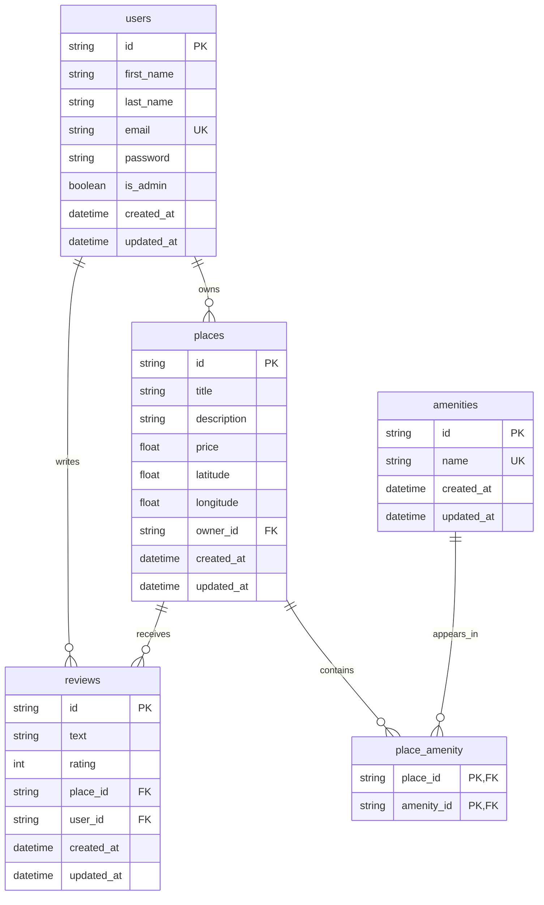

# HBnB Entity-Relationship Diagram

Rendered exports are available as [`er_diagram.svg`](er_diagram.svg) and
[`er_diagram.png`](er_diagram.png).

```mermaid
erDiagram
    users {
        string id PK
        string first_name
        string last_name
        string email UK
        string password
        boolean is_admin
        datetime created_at
        datetime updated_at
    }

    places {
        string id PK
        string title
        string description
        float price
        float latitude
        float longitude
        string owner_id FK
        datetime created_at
        datetime updated_at
    }

    reviews {
        string id PK
        string text
        int rating
        string place_id FK
        string user_id FK
        datetime created_at
        datetime updated_at
    }

    amenities {
        string id PK
        string name UK
        datetime created_at
        datetime updated_at
    }

    place_amenity {
        string place_id PK, FK
        string amenity_id PK, FK
    }

    users ||--o{ places : owns
    users ||--o{ reviews : writes
    places ||--o{ reviews : receives
    places ||--o{ place_amenity : contains
    amenities ||--o{ place_amenity : appears_in
```
